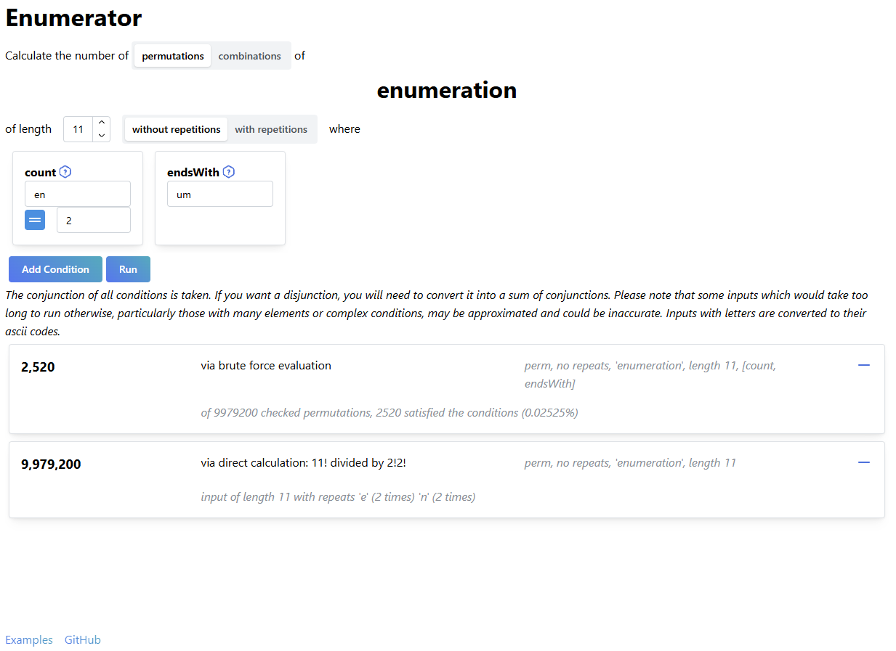

# Enumerator

A [website](https://szonglin.github.io/enumerator/) to perform simple enumeration tasks.



### Things it can do:

- Enumeration of permutations and combinations with or without repetition using a combination of brute force iterators and direct/dynamic approaches
- Several applicable conditions, including:
  - subarrays, subsequences, containment, exclusion, subarray count
  - monotonicity, palindromes, distinctness, derangements
  - sum, average, maximum, minimum
- Approximations for larger complex queries using Monte Carlo sampling
- Some examples [here](./other/examples.md)

### Things it might be able to do in the future:

- More conditions
- Faster algorithms for some conditions (especially subarray and contains)
- Perms over circles and with other symmetries
- Mode which searches over dictionary words
- Better random generation for perms without repetitions😭

### Usage:

You run the site locally by doing the following:

```bash
git clone git@github.com:szonglin/enumerator.git
cd enumerator
npm install
npm run dev
```

Then open http://localhost:5173/ in your browser.

_(or build and run preview at http://localhost:4173/)_
