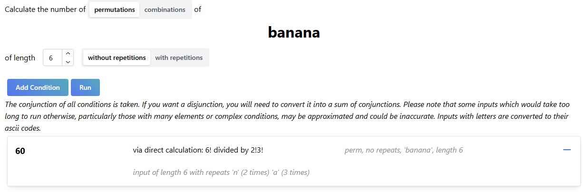
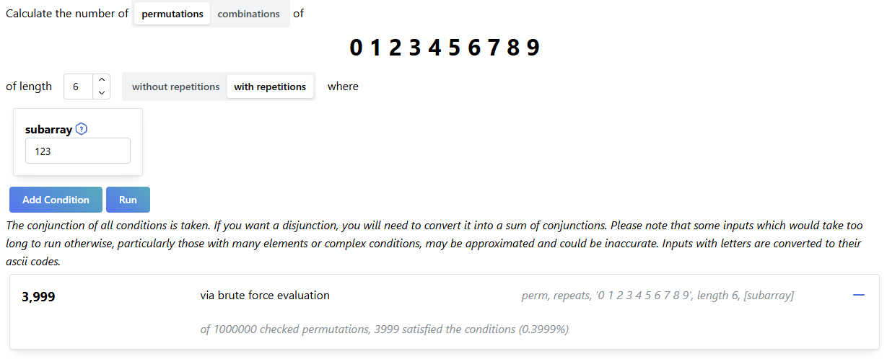
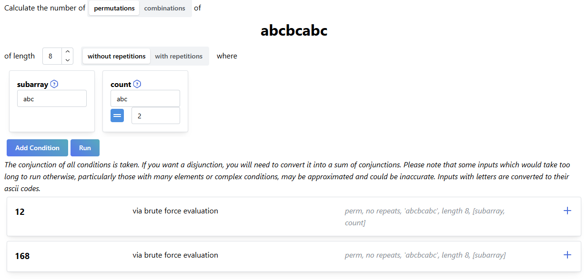
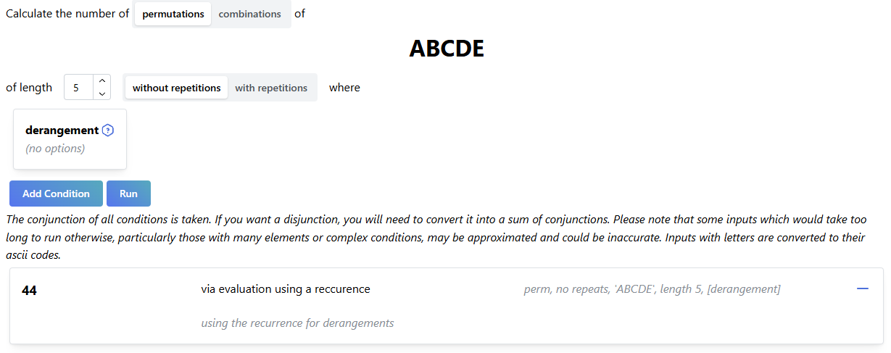
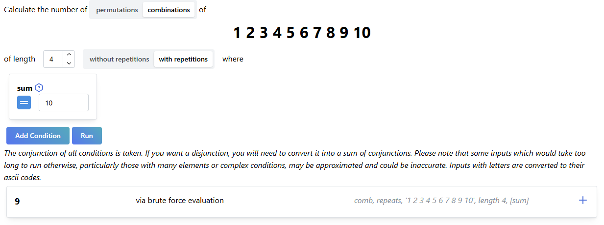
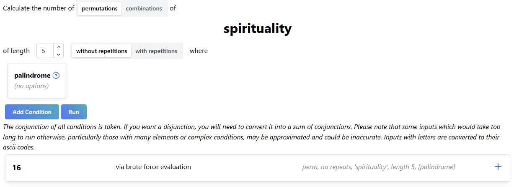
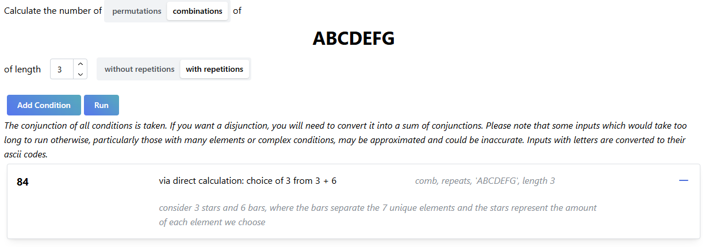
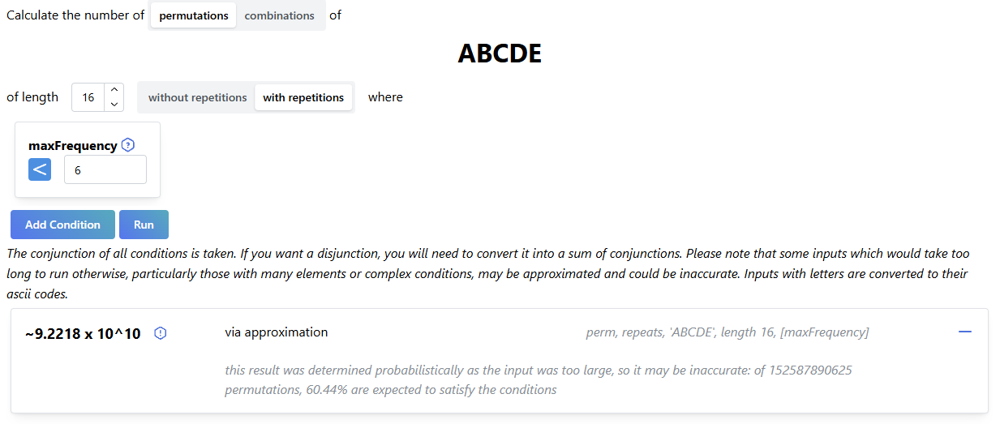
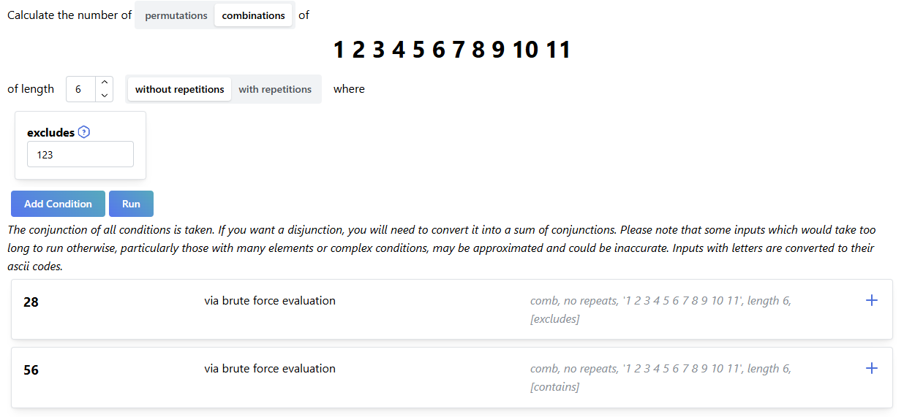
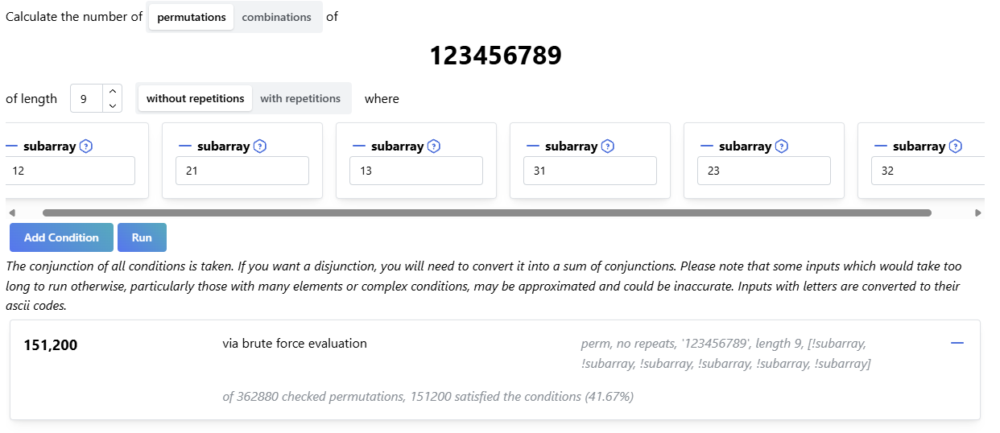

# Examples

### Permutation and Combination Problems

- How many permutations of the letters in the word `banana` are there?
  
- How many ways are there to choose a six digit password if your password must contain `123`?
  
- How many permutations of `abcbcabc` contain the subword `abc`? How many contain it twice?
  
- How many different ways can `5` people seated in a row switch seats, if no one sits in the same spot as before?
  
- How many combinations of `4` positive integers add to `10`?
  
- How many permutations of `5` distinct non-negative integers add to less than `15`?
  
- How many permutations of length `5` from `spirituality` are palindromes?
  
- How many ways are there to choose `3` scoops of ice cream from `7` flavours?
  
- How many ways can `16` people be divided into `5` distinct groups if no group may have more than `5` people?
  
- How many ways can a group of `6` people be chosen from `11` people if there are three people that want to either all be in the group or all not be in the group?
  
- How many ways can a group of three boys and six girls be ordered such that no two boys are seated next to each other? _(we have to get a bit creative with how we input this one...)_
  
